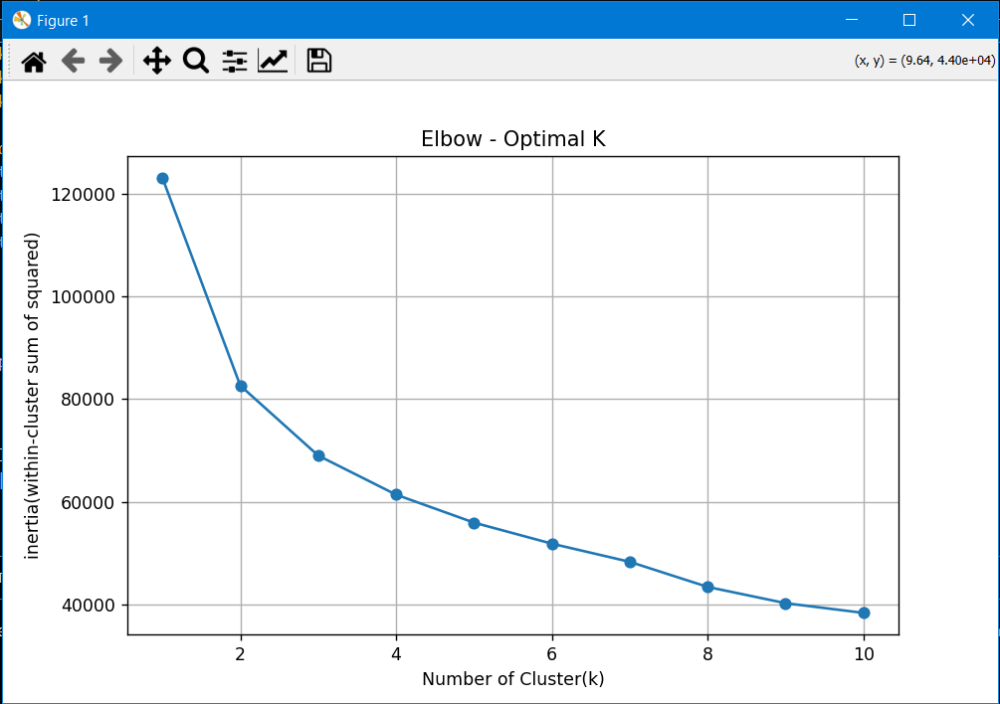

# 🌍 Air Quality Clustering & Anomaly Detection

This project involves applying data science and unsupervised machine learning techniques to analyze air quality data. The goal is to identify clusters of similar air conditions and detect anomalous readings that may signal pollution spikes, sensor errors, or rare weather patterns.

---

## 📦 Project Tasks & Deliverables

### ✅ 1. Cleaned & Preprocessed Dataset
- Removed missing/incomplete records
- Dropped non-numeric or irrelevant features
- Standardized data using `StandardScaler`
- Dataset saved as: `cleaned_air_quality_data.csv`

---

### ✅ 2. K-Means Clustering
- Applied KMeans clustering (optimal clusters: **3**) using the Elbow method
- Added cluster labels to the dataset
- Visualized using PCA (2D projection)

📷 **Screenshot:**  

---

### ✅ 3. Hierarchical Clustering (Dendrogram)
- Performed agglomerative clustering to explore nested structures
- Dendrogram confirms 3-cluster division consistency

📷 **Screenshot:**  

---

### ✅ 4. PCA Dimensionality Reduction
- Reduced features to 2 principal components
- Explained variance captured: ~70% (PC1: 51.5%, PC2: 18.8%)
- Used for clearer visualization of clustering and anomalies

📷 **Screenshot:**  

---

### ✅ 5. Anomaly Detection
- Measured distance from cluster centroids
- Marked top 5% farthest points as anomalies (total: **474** detected)
- Visualized anomalies on PCA plot in red

📷 **Screenshot:**  

---

## 🧰 Tools & Libraries Used

- Python 3.x
- `pandas`, `numpy`
- `matplotlib`, `seaborn`
- `sklearn` (KMeans, PCA, StandardScaler)
- `scipy` (dendrogram)
-  VS Code Python IDE

---

---

## 👨‍💻 Author

**Muhammad Yasir**  
AI Enthusiast | Python Developer | Data Science Learner  
📧 yaisikhan111@gmail.com  
🌍 Dera Ismail Khan, KP, Pakistan

---

## 📌 Note

This project is part of a broader learning initiative on unsupervised learning techniques for environmental and sensor-based datasets. Feel free to contribute or reuse with attribution.

